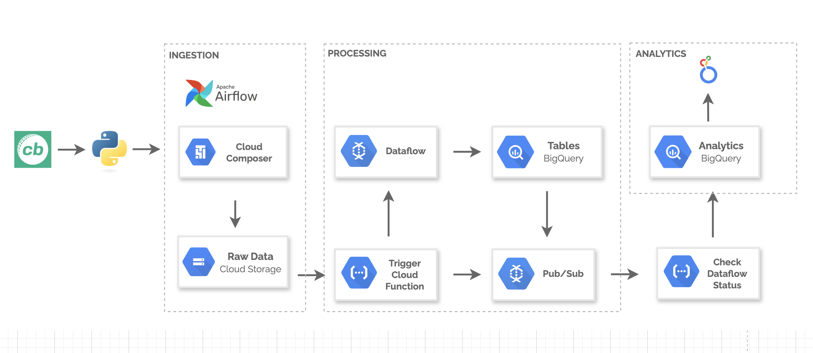
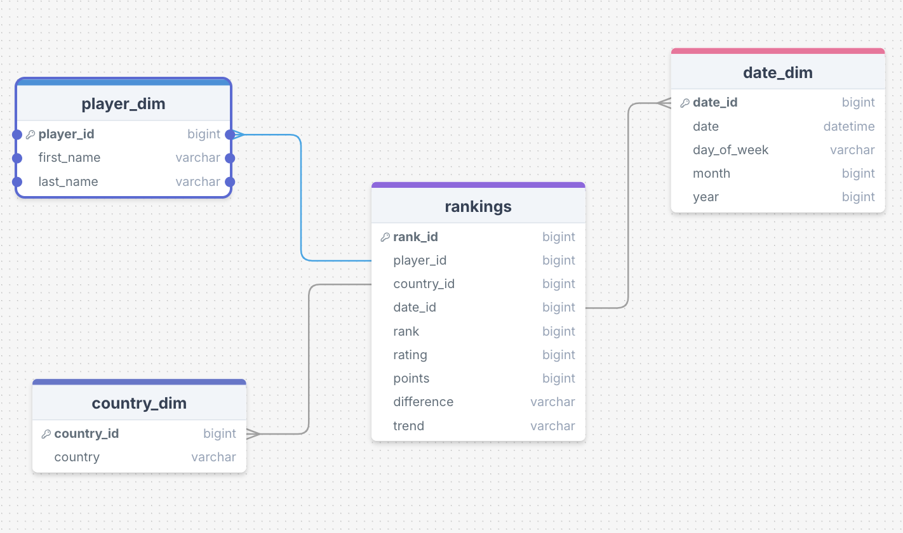
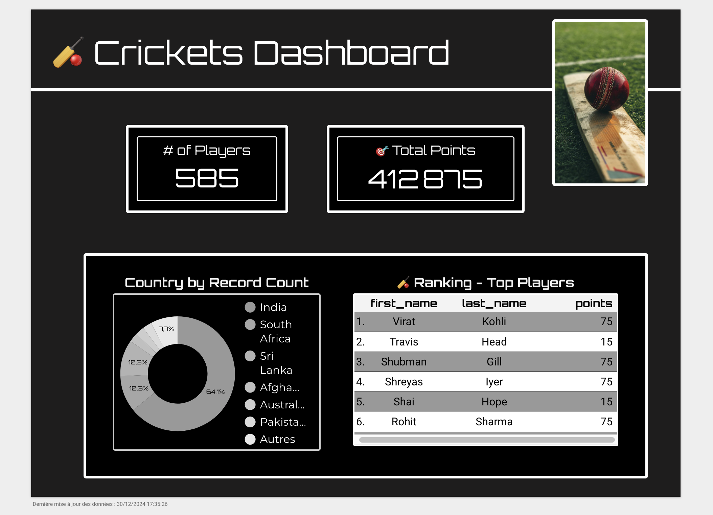

# 🏏 Cricket Statistics Pipeline with Google Cloud Services

## 🌟 Description

Welcome to our cricket statistics project that collects and processes data on **cricket matches** using Google Cloud services. The collected data is integrated into a **BigQuery** database via **Apache Airflow**, and we visualize it using **Looker Studio** to extract valuable insights.

## 🏗️ Project Architecture



## ⚙️ Technologies Used

- **Python**: For data retrieval from the Cricbuzz API.
- **Composer**: For orchestrating data collection and processing.
- **Cloud Function** : Automates table creation and data queries.
- **Google Cloud Storage (GCS)**: For storing data files.
- **Google BigQuery**: For data storage and analysis.
- **Looker Studio**: For data visualization.
- **Pub/sub**: Triggers notifications to Cloud Functions after successful processing.

## 📊 Data Modeling

The data collected from the Cricbuzz API is structured into a schema suitable for analysis. Here’s a brief overview of the data model:

- **Rankings Table**:

  - **rank_id** (Primary Key): Unique identifier for each rank.
  - **player_id**
    ...

Insert your data modeling diagram below (if you have one):  


## 🚀 Installation and Launch

Follow the steps below to get this project up and running:

### 1. Clone the repository

```bash
git clone https://github.com/yourusername/cricket-statistics-pipeline.git
```

### 2. 📡 Google Cloud Setup

1. **Create Storage Buckets **:
   - `bkt-ranking-data-ycb` for data source (csv)
   - `cricket_stats_dataflow` for dataflow

The `cricket_stats_dataflow` bucket contains the following directories and files:

    - config/
      - `config.ini`: Configuration settings for data processing.

    - templates/
      - `dataflow_template.py`: Python template for Apache Dataflow jobs.

    - staging
      - Intermediate data storage for processing.

    - tmp/
      - Temporary files used during Dataflow execution.

2. **Enable the Google Cloud Storage API**.

3. **Create a Service Account**:
   - Name it `crickets-project-account`, and assign the following roles:
     - `roles/storage.objectAdmin`: Full control over bucket objects.
     - `roles/bigquery.admin`: Full BigQuery access.
     - `roles/pubsub.publisher`: Access for Pub/Sub messaging.
       ... (other roles for composer, ...)
   - Generate a JSON key for the service account.

### 3. Composer Environment

1.  **Create a Cloud Composer environment**:

    - Name it `crickets-project-composer-env`.

2.  **Upload the following files in Composer env**:

    ## 📂 DAG Structure

    The `dags/` directory contains the following files and folders:

        - `dag.py`: Main DAG definition file.

        -  data
          - (This folder can include data files used in your workflows.)

        - config
          - `gcs.conf`: Configuration file for Google Cloud Storage.
          - `rapid-api.conf`: Configuration file for the Rapid API.

        - scripts
          - `api_data_to_gcs.py`: Script for retrieving data from the API and pushing it to GCS.

### Cloud Function

1. **Create a Cloud Function**:

   - Name it `trigger_df_job`.

2. **Set the Trigger Type**:

   - Cloud Storage (event: `google.cloud.storage.object.v1.finalized`).

3. **Assign the following roles**:
   - `roles/logging.logWriter`: For logging.
   - `roles/pubsub.publisher`: For triggering notifications.

### Run the Pipeline

1. **Push data to the GCS bucket**.
2. **Monitor the Airflow DAG in Cloud Composer**.
3. **Ensure that downstream services like Pub/Sub, Dataflow, and BigQuery execute as expected**.

## 📈 Data Collection

Data collection is performed through a Python script that scrapes cricket statistics from the Cricbuzz API.

Code complet Python : Load data from API + Push to GCS => api_data_to_gcs.py

👉 Cricbuzz API Documentation

## 📊 Looker Studio Dashboard

- analytics table (BigQuery)



Once the data is collected and processed, you can explore our interactive dashboard built with Looker Studio. The dashboard provides insights and visualizations of the cricket match data, including:

Match Trends: Visual representation of match outcomes over time.
Team Performance: Analysis of individual team performance metrics.
Score Insights: Overview of score distributions among matches.
You can access the dashboard through the Looker Studio interface once the data is loaded.

Insert your Looker Studio image below (if you have one):
Looker

## 🤝 Contributing

Contributions are welcome! Feel free to open an issue or submit a pull request.

## 👤 Authors

Youcef
Inspirations => https://www.youtube.com/watch?v=UXJxcWgxwu0&t=516s

## 📝 License

This project is licensed under the MIT License. For more details, please refer to the LICENSE file.
